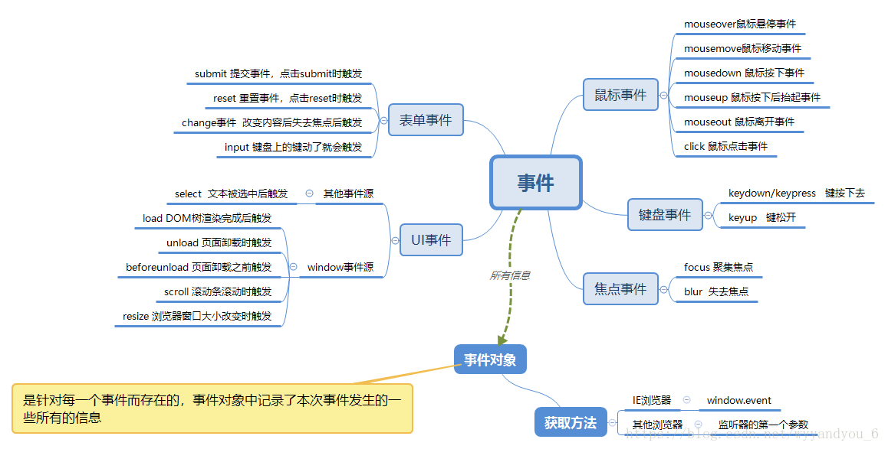
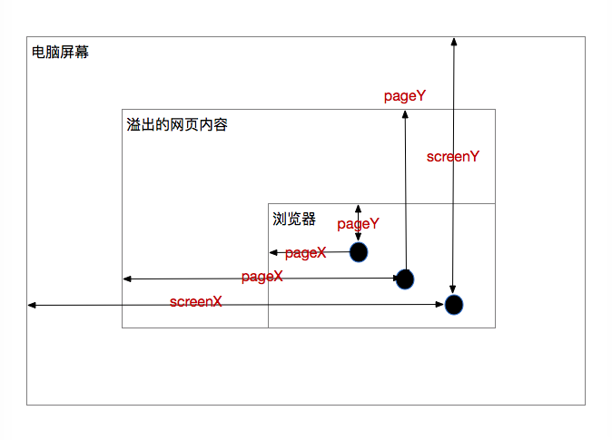
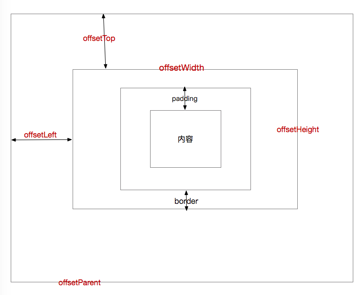
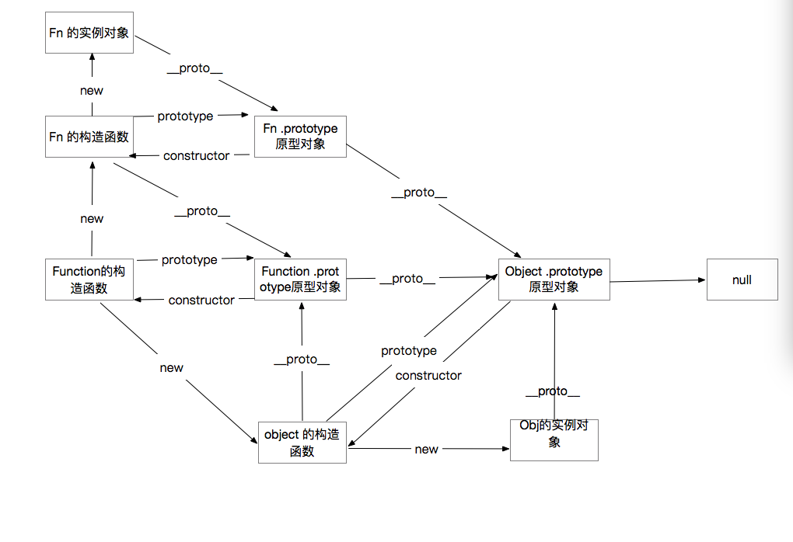

# 前端知识整理


# JavaScirpt

### 一  常用的内置对象及其方法

##### Math 对象

Math.abs( x ) : x 的绝对值

Math.ceil( x ) : x 向上取整后的值

Math.floor( x ) : x 向下取整后的值

Math.max( x, y, ... ) : 返回 0 到多个数值之中的最大值

Math.min( x, y , ...) : 返回 0 到多个数值之中的最小值

Math.random( ) : 返回 0 到 1 之间的随机数,包含 0 但不包含 1

Math.round( x ):  返回四舍五入后的整数


##### String 对象

String.length : 字符串的长度

String.concat("字符串1", "字符串2", ...) : 返回的是拼接后的字符串

String.indexOf("要找的字符串",从某个位置开始的索引) : 返回值是该字符串所在位置的索引,如果没有找到则返回 -1

String.replace("原来的字符串","新字符串") : 返回值是替换后的新的字符串

String.slice(开始的位置  [,  结束的位置]) : 返回值是从原字符串中提取出来的新的字符串

String.split("分隔符",切割后留下的字数) : 返回源字符串以分隔符出现位置分隔而成的一个 [`Array`](https://developer.mozilla.org/zh-CN/docs/Web/JavaScript/Reference/Array) 

String.substr(开始的位置 [,可选的字符数]) : 返回值是截取后的新的字符串

String.startsWith( ... ) : 是否以 ** 开头

String.ensWith( ... ) : 是否以**结尾

String.includes(...) ; 是否包含 ** 


##### Array 对象

Array.concat( 数组1 , 数组2 , ... ) : 合并两个或者多个数组,返回一个新的数组,并不会改变原有数组

**Array.filter( 处理函数 ) : 一个新的通过测试的元素的集合的数组，如果没有通过测试则返回空数组**

**Array.forEach( function( elements [, index , array ]){  ... } ) : 遍历数组,数组中每一项执行定义的操作**

Array.push( 值 ) : 把值追加到数组的最后,**返回值是插入后的数组长度**

Array.pop(  ) : 删除数组最后的一个元素,返回值是删除的这个元素

Array.unshift( 值 ) : 在数组的开头插入一个元素,**返回值是插入后的数组长度**

Array\.shift(  ) : 删除数组开头的第一个元素,返回值是删除的这个元素

Array.indexOf( 值, 开始的索引 ) : 找出某个元素在数组中的索引,找不到就返回 -1 

Array.splice(开始的位置,要删除的个数,替换的元素的值) : 返回值是删除元素或者添加元素后的一个数组

Array.slice(开始的位置,结束的位置) : 一个含有提取元素的新数组

Array.reverse(  ) : 反转数组

Array.sort(  ) : 数组排序

Array.join( "字符串" ) : 方法将一个数组（或一个[类数组对象](https://developer.mozilla.org/zh-CN//docs/Web/JavaScript/Guide/Indexed_collections#Working_with_array-like_objects)）的所有元素连接成一个字符串并返回这个字符串。

Array.filter(function(){...}) :

Array.map( function(   ){ ... } ) :`**map()**` 方法创建一个新数组，其结果是该数组中的每个元素都调用一个提供的函数后返回的结果。

Array.some( ... ) : 判断数组中至少有一个元素满足条件

Array.every( ... ) : 判断数组中的所有元素是否满足条件

Array.find( ... ) : 返回满足条件的第一个元素

Array.findIndex( ... ) : 返回满足条件的第一个元素的索引值


### 二 数据类型

简单数据类型 : number string boolean undefined null

复杂数据类型 : function 函数 object 对象 

##### 注意:

简单数据类型传递的是值,复杂数据类型传递的是地址

**null : null 表示一个空的值,它和 0 和 "" 字符串不同, 0 是一个数值, "" 表示一个长度为 0 的字符串, 而 null 表示空 **                                                                                                                                                                    


**判断数据类型: **

**简单数据类型 : typeof       例 : typeof  变量 **

**复杂数据类型 : instanceof 例 : 对象 instanceof 构造函数**  


***相等转换原则(隐式转换) : 按照顺序依次转换***

***1 - NaN 与任何值不相等,包括它自身 NaN != NaN***

***2 - null 与任何值不相等,除了 null 和 undefined***

***3 - undefinef 与任何的值不相等,除了 null 和 undefined***

***4 - 如果操作数的两边有布尔类型或者数字,都转成数字进行比较***

***5 - 如果操作数两边都有字符串,都转成字符串进行比较***


### 三  DOM (Document Object Model) 文档对象模型  and BOM (Browser Object Model) 浏览器对象模型

	DOM 是一套可以操作页面的 API , DOM 可以把 HTML 看作是文档树, 通过 DOM 提供的Api可以对树立的节点进行操作


**API: Application Programming Interface 应用程序编程接口,目的是提供应用程序与开发人员基于某硬件或者软件得以访问一组例程的能力,而又无需访问源码,或者理解内部工作机制的细节**


##### DOM中常用的事件




##### 事件对象: 在触发事件的时候,都会产生一个事件参数对象 Event ,这个对象中包含所有与事件相关的一些信息,包含出发时间的元素,事件类型与其他事件相关的信息


**事件对象的常用属性** : 



clientX 和 clientY : 相对于浏览器左上角的距离

pageX 和 pageY : 相对于网页内容左上角

screenX 和 screenY : 相对于屏幕左上角的距离

#### offset系列



offsetWidth , offsetHeight : 元素自身的真实宽高

offsetLeft: 元素自身左侧到 offsetParent 左侧的距离

offsetTop: 元素自身顶部到 offsetParent 顶部的距离


##### 事件流 : 从页面中接收事件的顺序


事件流的三个阶段: 

事件捕获阶段: 事件从根节点流向目标节点，途中流经各个DOM节点，在各个节点上触发捕获事件，直到达到目标节点。(从上至下)

事件目标阶段:事件到达目标节点时，就到了目标阶段，事件在目标节点上被触发

事件冒泡阶段: 事件在目标节点上触发后，不会终止，一层层向上冒，回溯到根节点。(从下至上)


**如何阻止事件冒泡?**

**w3c的方法是e.stopPropagation()，IE则是使用e.cancelBubble = true;**

**取消默认事件**

**w3c的方法是e.preventDefault()，IE则是使用e.returnValue = false;**

**事件委托和事件绑定**

**事件绑定**: 将普通的事件 event 绑定在 DOM 节点上,当DOM节点被选中时，将事件与之绑定，方便用户提供相应的操作。

`$('.bn1').click(function(){...})`就是普通的事件绑定。

**事件委托:**是指在事件绑定的基础上补充与扩展事件绑定,具体就是指: 通过子节点元素绑定事件来传递 DOM 节点(祖先节点)来统一管理其全部后代子元素

```j&#39;s
$('.div').on('click','.bn2',function(){...})
```

**事件监听**: addEventListener(event, function, useCapture) 为一个元素注册多个互不相干的事件

### 四 逻辑中断

&&: 从左到右找假值,如果找到了,逻辑中断,返回假值(返回的是布尔类型为 false 的那个值的本身)

||: 从左到右找真值,如果找到了,逻辑中断,返回真值(返回的也是布尔类型为 true 的这个值的本身)

```js
var scrollTop = window.pageOffset || document.documentElement.scrollTop || document.body.scrollTop || 0
```

### 五 面向过程和面向对象

面向过程: 执行者凡事都亲力亲为

面向对象: 指挥者对面向过程进行了封装

##### 面向对象三大特性

**封装**: 封装就是把客观事物封装成抽象的类,并且类可以把自己的数据和方法只让可信的类或者对象进行操作,对不可信的进行信息隐藏.一个类就是一个封装了数据以及操作这些数据的代码的逻辑实体.在一个对象内部,某些代码或者某些数据可以是私有的,不能被外界访问的,通过这种方式,对象对内部数据提供了不同级别的保护,以防止程序中无关的部分意外的改变或者错误的使用;了对象的私有部分

**继承**: 可以让某个类型的对象获得另一个类型对象的属性和方法

**多态**: JS 不支持多态,但是多态是指一个实例的相同方法在不同情形有不同饿表现形式


##### 面向对象的基本思路: 

1 在构造函数里写实例属性

2 在原型上写共享的数据

##### 当 new 一个新对象的时候,发生了下面几件事情

1 创建了一个新的对象

2 改变了this 的指向

3 给这个实例添加方法和属性

4 返回 this


### 六 原型相关

**原型的作用 : 数据共享,节省内存空间**

**原型的写法 : 构造函数. prototype. 属性 = 值**

		      构造函数.prototype.方法 = 函数

**简单原型的写法: var obj = { ... } 缺陷: 原型直接指向 Object, 没有构**

	任何函数都有 prototype 属性,函数的 ptototype 属性的值是一个对象,称之为原型对象,通过构造函数创建的实例对象可以直接访问这个构造函数的原型对象(prototype)上的任意成员

**(一般把实例对象需要共享的数据放在原型上,减少内存浪费的问题)**

	任何对象都有__ proto__ 属性,指向的是构造函数的 prototype (原型)
	
	**所以访问原型对象现在有两种途径,一是通过构造函数的 prototype 访问原型,二是通过实例对象的__ proto__ 访问原型**

#### 原型链

	任何对象都有__ proto__ 属性,指向了原型对象 prototype, 原型对象也是对象,原型也有__ proto__ 属性,指向了原型对象的原型属性,所以原型对象也有自己的原型对象,这样形成的一条链式结构就称之为原型链


任何对象的原型链上都有 Object.prototype 最终都指向 null

ren'he

##### 属性查找原则(属性搜索原则): 沿着原型链进行查找

(1) 对象查找属性,首先在当前对象自身上找,如果找到了该属性就直接返回

(2) 如果在对象自身上没有查找到,去对象的原型上进行查找,如果找到了直接返回

(3) 如果在对象的原型上没有找到,继续沿着对象的原型链向上查找,直到 Object.prototype, 如果找到了直接返回

(4) 如果都没有找到,就返回 undefined


#### Object.prototype 上的成员(属性)

	因为任何对象的原型链上都有 Object.prototype, 所以有必要熟悉 Object原型上的属性

##### (1) constructor: 构造器 

(指向它的构造函数 Object ,返回对创建此对象的数组函数的引用)

##### (2)hasOwnProperty( ... ) :是否有自己的属性

语法 : 对象. hasOwmProperty("属性") 

作用 : 判断该属性是否是对象自身的,如果是返回 true, 否则返回 false

##### In 和 hasOwnProperty 的区别

in 运算符: 判断属性能否被对象访问到,不管属性是对象自身的还是原型链上的,只要能够访问到到,就返回 true ,访问不到,就返回 false

语法 : "属性" in 对象

##### hasOwnProprety 的使用场景: 使用在 for ... in  的循环里,过滤出对象自身的属性, for ... in 在遍历对象的时候,会把对象自身和原型链上的属性都遍历到(可遍历的属性)

```js
for ( var key in object) {
    if (object.hasOwnProperty(key)){
        ...
    }
}
```


##### (3) propertyEnumerable( ... ) : 属性是否可以遍历

##### 语法: 对象. propertyEnumerable("属性") 

##### 作用:  判断属性是否可以遍历

	(1) 判断属性是否是对象自身的

(2) 判断属性是否可以遍历

	(2) 判断属性是否可以遍历

##### 只有满足了以上两个条件才返回 true

##### --	 Object.defineProperty( ... )  : 定义属性

语法 : Object.defineProperty( obj , prop , desc );

参数 1 : 给对象添加的属性指定是哪个对象

参数 2 : 给对象添加说明属性, 是个字符串

参数 3 : 属性描述,是个对象

```js
Object.defineProperty(obj , 'gender', Object.defineProperty(obj , 'gender,{
    value: female'',	// value 给这个对象的该属性设置默认值
    enumerable: true,	// enumerable 设置属性是否可以遍历 true/ 可遍历
    writable: false 	// writable 属性是否可以修改 true/ 可修改 
})
```

c

##### (4) isPrototyprOf ( ... ) : 是否是原型归属

语法 : 对象 A.isPrototypeOf(对象 B )

作用 : 判断 A 对象是否在 B 的原型链上

##### instanceof 和 isPrototypeOf 的区别

##### Instanceof:

##### 	语法: 对象 instanceof 构造函数

##### 	作用: 判断构造函数的 prototype 属性是否在对象的原型链上,如果在就返回 true

区别: 作用是一样的,区别在于写法

对象 A.isPrototyprOf(对象 B) // 判断 A 是否在对象 B 的原型链上

对象 B.instanceof A //判断 A 的 prototype 属性是否在 A 的原型链上( A 是构造函数 )


##### (5) valueOf(  ) , toString(  ) .toLocaleString(  )

valueOf( ... ) : 将对象转成原始值(简单数据类型) ,但是默认的(Object.prototype 上的 valueOf )只能返回对象自身

toString( ... ) : 将对象转换成字符串,每个内置对象上都提出来 toString() 方法

toLocaleString(...) : 和 toString 没有区别,在日期对象上的差异

对象在参与运算或者比较的时候, js 内部会帮我们自动调用 valueOf && toString 两个方法

##### 调用规则:

1 首先调用 valueOf 的方法,尝试将对象转换成简单数据类型,如果没有转成简单数据类型,就继续调用 toString 方法转成字符串

2 如果对象分别调用 valueOf 和 toString 两个方法,都没有转成简单数据类型,则报错


### 七 沙箱

	是一个独立和封装的环境,内部的代码是不会影响到外部的
	
	**自调用函数:创建了一个函数的同时调用了自己(一般一个 JS 文件只暴露一个核心变量(函数),减少全局污染——自调用函数也是沙箱模式)**


### 八 严格模式

	ES5提出来的一种代码运行模式
	
	开启严格模式——特殊的写法----" use strict" (这句话后面的所有的代码都遵循严格模式)
	
	严格模式下无法运行的代码:
	
	1 - 变量必须显示声明
	
	2 - 函数参数不能重名
	
	3 - 禁止使用八进制
	
	4 - 不能使用保留字作为变量名称

建议 : 不要在全局里面开启严格模式,一般严格模式配合沙箱去使用

注意点 : 一般开启严格模式" use strict" 必须写在当前作用域的最顶部

严格模式的好处 : 代码规范,执行效率高,为了以后的 JS 版本做铺垫


### 九 继承

混入式继承 : 拷贝一个对象的属性或者方法

原型链继承 : 通过构造函数创建的实例对象可以直接继承原型上的任意成员

混入式继承+原型链继承 : 

经典继承: Object.create( ... )

语法 : var newobj = Object.create(obj)

参数 obj : 是一个对象

作用 : 该方法创建的是一个空对象,返回的对象的原型是参数 obj


### 十 try...catch 尝试捕获

对于可能会报错的代码,使用 try...catch ,就会阻止报错

try : 尝试

catch : 捕获

```j&#39;s
try{
   try 中的代码是会被执行的,如果代码有错,会被 catch 捕获到进入 catch 语句,可以阻止报错,不会影响到后面代码的执行 
}catch{
    e : 是个错误对象
}

eval( ... ) 将字符串视为 JS 代码来执行和 new Function 的作用一样
```


### 十一  this 的指向问题

任何函数都有属于自己的 this

	**this 是动态性的,只有当函数调用的时候才能确定 this 的指向,也就是说,当函数写好了以后是不能确定 this 指向的, this 指向和函数在哪里被调用是没有关系的**


##### 分析 this 的思路(规律)

	this 是属于哪个函数的
	
	这个函数是如何被调用的

##### 函数的四种调用模式中的 this 的指向

	函数调用模式 :  this 指向 window
	
	对象(方法)调用模式 : this 的指向就是谁调用了这个方法, this 就指向谁
	
	构造函数模式 : this指向的是实例对象
	
	上下文模式(借用模式) : call apply bind (apply 内的第二个参数是数组或者伪数组)


### 十二 数组和伪数组

伪数组会经常借用数组的方法,伪数组是一个对象,有数字下标和 length 长度属性,能和数组一样遍历,但是不能使用数组的方法

特征:

	有数字下标
	
	有 length 属性
	
	不能使用数组的方法


### 十三 Function.prototype 成员

arguements : 是原型上的属性,函数的实参列表(已废弃)通过函数内部的 arguements 来获取

caller : 获取函数是在哪个函数里被调用的 (废弃)

constructor : 指向了构造函数 Function

length :函数形参的个数

name : 函数的名字

tostring : 转字符串


### 十四 预解析和作用域

预解析 : 预先解析

优先提升函数,然后是变量的提升,如果遇到重名的变量则忽略

作用域 : 变量声明后,能够在哪个范围内起作用

作用域链 : 函数能够形成作用域,如果函数被嵌套在另一个函数中,嵌套的函数也有自己的作用域,从这个作用域向外延伸形成的一条链称为作用域链 

**变量搜索规则,现在当前的作用域查找,找不到向上级查找,直到全局作用域,如果都没有就报错**


### 十五 递归

递归函数: 内部自己调用自己,注意的是一定要有结束的条件

递归的主要思想是将一个复杂问题转换为简单问题

**缓存 : 储存数据的容器 cache**

在 JS 里面,使用数组或者是对象用来做储存数据的容器,我们使用键储存,用键取值

使用缓存的思路 : 首先去容器里查看有没有对应的数据,如果有,直接取出来使用,如果没有,先去计算结果,把结果储存到缓存中,方便下次使用


### 十六 闭包

闭包是函数和声明该函数的司法环境的组合

函数 : 内部函数

声明该函数 :　外部函数

词法环境 :　作用域

组合 : 以上形成的综合体

形成的条件 : 有两个函数,是嵌套关系,内部函数访问了外部函数声明的变量

作用 : 私有化函数保护数据安全,持久化维持数据

问题 : 占有的内存是不会被释放的,造成内存泄露的问题

内存泄露 : 一块内存空间被占用了 ,一直得不到回收,别的对象就使用不了这块空间


# AJAX(Asynchoronous Javascript And XML)

AJAX 不是一门新的语言,而是对现有持术的综合利用

**本质 : 是在 HTTP 协议的基础上通过 js 的 XMLHttpRequest 对象与服务器进行通信**

**作用 : 可以在页面不刷新的情况下,请求服务器,局部更新页面数据**


#### XMLHttpRequest

浏览器内建对象,用于后台与服务器通信(交互数据),由此我们便可以实现对网页的部分更新,而不是刷新整个页面

##### HTTP 协议


##### 发送 get 请求

XMLHttpRequest 以异步的方式发送 HTTP 请求,因此在发送请求时候,一样要遵循 HTTP 协议

```js
// 1 创建一个 XMLHttpRequest 对象
const xhr = new XMLHttpRequest();
// 2 设置请求行
xhr.open('get',请求地址);
// 3 设置请求头 get 请求无须设置
xhr.setRequestHeader('content-type','text/html');
// 4 设置请求体 get 请求的请求体为空,因为参数拼接到 url 后面了
xhr.send(null);

注意点: 
get 请求设置请求行时,需要把参数拼接到 url 后面
get 请求不用设置请求头
get 请求的请求体为 null
```


##### 发送 post 请求

```js
const xhr = new XMLHttpRequest();
// 1 设置请求行,post 请求的参数列表在请求体中
xhr.open('post',请求地址);
// 2 设置请求头
xhr.setRequestHeader('content-type','application/x-www-form-urlencoded');
// 3 设置请求体
xhr.send('name=hc&age=18');

注意点:
post 请求必须设置请求头 content-type的属性为 application/x-www-form-urlencoded
post 请求必须将参数列表设置到请求体中
```

##### 获取响应

HTTP 响应分为三个阶段,响应行,响应头,响应体

```js
//给xhr注册一个onreadystatechange事件，当xhr的状态发生状态发生改变时，会触发这个事件。
xhr.onreadystatechange = function () {
  if(xhr.readyState == 4){
    //1. 获取状态行
    console.log("状态行:"+xhr.status);
    //2. 获取响应头
    console.log("所有的相应头:"+xhr.getAllResponseHeaders());
    console.log("指定相应头:"+xhr.getResponseHeader("content-type"));
    //3. 获取响应体
    console.log(xhr.responseText);
  }
}
```

##### readyState

```js
// 0: 请求未初始化(还没有调用 open);
// 1: 请求已经建立,还没有发送(还没有调用 send())
// 2: 请求已发送,正在处理中
// 3: 请求在处理中,通常响应中已有部分数据可用了,但是服务器还没有完成响应的生成
// 4: 响应已经完成,可以获取服务器的响应了(在这一步处理结果)
```

##### 前后端分离

- 在前端写好页面以后，需要后台进行修改，意味这后端程序员也需要懂前端的知识，其实渲染的工作应该交给前端来做。
- 前端没有写好页面的话，后端无法开始工作，需要等待前端的页面完成之后才能开始工作，拖延项目 的进度。
- 在客户端设备多元化的情况下，后台渲染的页面无法满足所有用户的需求
- 前后端代码混合在一个文件中，项目修改和维护成本高

##### 接口化开发

请求地址即所谓的接口，通常我们所说的接口化开发，其实是指一个接口对应一个功能， 并且严格约束了**请求参数** 和**响应结果** 的格式，这样前后端在开发过程中，可以减少不必要的讨论， 从而并行开发，可以极大的提升开发效率，另外一个好处，当网站进行改版后，服务端接口进行调整时，并不影响到前端的功能。


##### XML 和  JSON

##### XML:

XML 是指可扩展标记语言

XML 的设计宗旨是传输数据而非显示数据

XML 的标签没有被预定义,需要自行定义标签

**语法规范**

- 第一行必须是版本信息
- 必须有一个根元素（有且仅有一个）
- 标签不可有空格、不可以数字或.开头、大小写敏感
- 不可交叉嵌套，都是双标签，如果是单标签，必须闭合
- 属性双引号（浏览器自动修正成双引号了）
- 特殊符号要使用实体 
- 注释和HTML一样

##### JSON

JSON(JavaScirpt Object Notation)是一种轻量级的数据交换格式,用来储存和表示数据

## 文件上传

> 以前，文件上传需要借助表单进行上传，但是表单上传是同步的，也就是说文件上传时，页面需要提交和刷新，用户体验不友好，xhr2.0中的formData对象支持文件的异步上传。

```javascript
var formData = new FormData();
//获取上传的文件，传递到后端
var file = document.getElementById("file").files[0];
formData.append("file", file);
xhr.send(formData);
```


##### 模板引擎

### artTemplate入门

**1.引入模板引擎的js文件** 

```javascript
<script src="template-web.js"></script>
```

**2.准备模板** 

```html
<!--
  指定了type为text/template后，这一段script标签并不会解析，也不会显示。
-->
<script type="text/template" id="tmp">
  <p>姓名：{{ username }}</p>  
  <p>年龄：{{ age }}</p>
  <p>技能：{{ skill }}</p>
  <p>描述：{{desc }}</p>
</script>
```

**3.准备数据**

```javascript
//3. 准备数据,数据是后台获取的，可以随时变化
var json = {
  userName:"隔壁老王",
  age:18,
  skill:"查水表",
  desc:"年轻气壮"
}
```

**4.将模板与数据进行绑定**

```javascript
//第一个参数：模板的id
//第二个参数：数据
//返回值：根据模板生成的字符串。
var html = template("myTmp", json);
console.log(html);
```

**5.将数据显示到页面**

```javascript
var div = document.querySelector("div");
div.innerHTML = html;
```

**注意：传递给模板引擎的数据必须是对象**

### artTemplate语法

**if语法**

```html
{{if gender='男'}}
  <div class="man">
{{else}}
  <div class="woman">
{{/if}}
```

**each语法**

```html
<!--
  1. {{each data}}  可以通过$value 和 $index获取值和下标
  2. {{each data v i}}  自己指定值为v，下标为i
-->
{{each data v i}}
<li>
  <a href="{{v.url}}">
    
    <p>{{v.content}}</p>
   </a>
 </li>
{{/each}}
```

```javascript
//如果返回的数据是个数组，必须使用对象进行包裹，因为在{{}}中只写书写对象的属性。
var html = template("navTmp", {data:info});
```

##### 同源和跨域

同源

同源策略 : 协议相同,域名相同,端口相同   不同源则跨域

同源策略的目的 : 是为了保护用户信息的安全,防止恶意网站窃取数据

跨域 不同源即跨域

##### jsonp

利用 script 的 src 属性可以跨域访问不同源的 js 脚本,在服务器端返回一段调用某个函数的 js 代码在 src 中执行,完成跨域 

### CORS的具体流程（了解）

1. 浏览器会根据**同源策略** 查看是否是跨域请求，如果同源，直接发送ajax请求。
2. 如果非同源，说明是跨域请求，浏览器会自动发送一条请求（**预检请求** ），并不会携带数据，服务器接受到请求之后，会返回请求头信息，浏览器查看返回的响应头信息中是否设置了`header('Access-Control-Allow-Origin:请求源域名或者*');`
3. 如果没有设置，说明服务器不允许使用cors跨域，那么浏览器不会发送真正的ajax请求。
4. 如果返回的响应头中设置了`header('Access-Control-Allow-Origin:请求源域名或者*');`,浏览器会跟请求头中的`Origin: http://www.study.com`进行对比，如果满足要求，则发送真正的ajax请求，否则不发送。
5. 结论：**跨域行为是浏览器行为，是浏览器阻止了ajax行为。服务器与服务器之间是不存在跨域的问题的**

【案例：图灵机器人】

### 其他的跨域手段（没卵用）

以下方式基本不用，了解即可：

1、顶级域名相同的可以通过domain.name来解决，即同时设置 domain.name = 顶级域名（如example.com）
2、document.domain + iframe
3、window.name + iframe
4、location.hash + iframe
5、window.postMessage()


# HTML5 和  CSS3

浏览器的私有前缀

谷歌,苹果浏览器 -webkit- 	blink 内核

火狐浏览器 --moz-		Gecko 内核

IE浏览器 -ms-			Trident 内核

欧朋浏览器 -o-			blink 内核

```js
div {
    width: 200px;
    height: 200px;
    background-color: pink;
    margin: 100px auto;

    /*谷歌浏览器和safari浏览器的前缀 -webkit-*/
    -webkit-transform: rotate(45deg);
    /*火狐浏览器的前缀 -moz-*/
    -moz-transform: rotate(45deg);
    /*ie浏览器的前缀 -ms-*/
    -ms-transform: rotate(45deg);
    /*opera浏览器的前缀 -o-*/
    -o-transform: rotate(45deg);
    /*规范化后的写法*/
    transform: rotate(45deg);
}
```

## 关系选择器


## 属性选择器


## 伪类选择器

> 伪类选择器的语法：都带有一个 冒号 `:`

### child系列（重点）


思考：

```
1. 第一列变成红色
2. 最后一列变成红色
3. 倒数第二列变成红色
```

### 其他伪类选择器

```
:of-type系列，  用法与child系列很像，但是找的是子元素中对应类型的下标（了解，用的不多）
:focus    查找获取到焦点的文本框
:checked 获得选中的checkbox
:disabled 获得不可用的框
:enabled 获得可用的框
:not(selector)选择不匹配selector的那些元素
:target  获取当前活跃的锚链接
```

## 伪元素选择器

### before和after

```
注意事项：
//1.    必须指定content属性，可以在content属性中写入文本内容，但是通常为空字符串。
//2.    默认是行内元素，无法设置宽高，需要指定display:block或者position:absolute
E::before :在元素子节点的最前面添加一个内容。
E::after  :在元素子节点的最后面添加一个内容。
```

关于单冒号和双冒号问题：

```
关于:before与::before的区别
:before是css2中伪元素的写法，但是呢，在css3中严格规定，伪类采用单冒号，伪元素需要使用双冒号。为了兼容旧的代码，当浏览器碰到了:before之后，会自动的转换成::before。
如果需要兼容老的浏览器，比如IE678，推荐使用:before
如果不需要兼容老的浏览器，比如移动端，推荐使用::before
```

### 其他伪元素选择器

```
::first-letter  :获取元素的第一个字符
::first-line   :获取元素的第一行
::selection   ：获取选中的元素
```

#### CSS3 阴影

##### 文字阴影

text-shadow : 水平偏移 垂直偏移 羽化大小 颜色

##### 边框阴影

box-shadow 

```css
none： 无阴影 
<length>：第1个长度值用来设置对象的阴影水平偏移值。可以为负值 
<length>：第2个长度值用来设置对象的阴影垂直偏移值。可以为负值 
<length>：如果提供了第3个长度值则用来设置对象的阴影模糊值。不允许负值 
<length>：如果提供了第4个长度值则用来设置对象的阴影外延值。可以为负值 
<color>：设置对象的阴影的颜色。 
inset：设置对象的阴影类型为内阴影。该值为空时，则对象的阴影类型为外阴影
```

#### CSS3 背景

背景尺寸 : background-size

背景区域大小 : background-clip // border-box padding-box content-box

背景图片的原点(默认 padding) : background-origin  // border-box padding-box content-box

##### 多重背景 : background 设置背景的时候,可以设置多个背景,使用逗号隔开,注意颜色只能设置一次,并且通常来说,颜色都是在最后面设置

```css
background: url(image/mnl.jpg) no-repeat top left,
url(image/mn2.jpg) no-repeat right bottom,pink
```

#### CSS3渐变

##### 线性渐变 : linear-gradient 指沿着某条直线朝一个方向产生的渐变效果

```css
/* background-image: linear-gradient( 方向, 颜色 范围, 颜色 范围, 颜色 范围 ); */
background-image: linear-gradient(to right, red, green)
background-image: linear-gradient(45deg, red, green)
```

##### 镜像渐变 : radial-gradient 指从一个中心点开始沿着四周产生渐变效果

```css
/*1. 最简单的渐变*/
background-image: radial-gradient(red, green);

/*2. 指定圆的半径和圆心*/
background-image: radial-gradient(200px at center, red, green);

/*3. 指定椭圆*/
background-image: radial-gradient(200px 80px at center, red, green);

/*4. 指定范围*/
background-image: radial-gradient(200px at center, green 50%, red 50%);
```


#### 过渡

```css
/* 
transition-property: 设置过渡属性
transition-duration: 设置过渡时间
transition-delay; 设置过渡延时
transition-timing-function; 设置过渡的速度
linear ease ease-in ease-out ease-in-out steps(10)
*/

合写: 属性 时间 延时 速度
transition: width 1s 3s linear
```

注意点 :

过渡必须要有两个状态的变化

过渡可以写在 A 状态,也可以写在 B状态,但是如果写在 B 状态,那么回来的时候,就没有过渡效果了

#### 2D转换

transform: 转换,是 CSS3最具颠覆性的集合特性之一,即可以用于2D 转换,也可以用于3d 转换

transform: 2D 转换,元素在平面上实现移动,旋转,缩放,斜切等操作

##### scale : 缩放

```css
transform: scaleX(0.5);/*让宽度变化*/
transform: scaleY(0.5);/*让高度变化，注意不能写多个transform，不然会覆盖。*/
transform: scale(0.5);/*让宽度和高度同时变化*/
```

注意：

- scale接收的值是倍数，因此没有单位
- scale可以是一个值，如果是一个值，不是说仅仅缩放宽度，高度也会等比例的缩放。
- 可以通过transform-origin设定旋转原点

##### translate: 平移

```javascript
transform: translateX(100px);
transform: translateY(100px);
transform: translate(100px, 100px);
transform: translate(50%, 50%);
```

- translate的值可以是px，也可以是百分比，如果是百分比，那么参照的是自身的宽高。
- translate移动的元素并不会影响其他盒子，类似于相对定位。

##### rotate: 旋转

```javascript
transform: rotate(360deg);//旋转360度
transform: rotate(-360deg);//逆时针旋转360度
```

- 单位是deg，角度，不是px
- 正值顺时针转，负值逆时针转
- 可以通过transition-origin设定旋转原点

##### skew: 斜切

```javascript
/*在水平方向倾斜30deg*/
transform: skewX(30deg);
/*在垂直方向倾斜30deg*/
transform: skewY(30deg);
```

skew在实际开发中，是用的最少的一个属性。一般来说，x和y只会倾斜其中的一个

Transform-origin 转换原点

```javascript
transform-origin: center center;
transform-origin: 40px 40px;
```

##### 合写问题

transform 属性可以连写,但是顺序对效果影响,因为它会在第一个效果的基础上执行第二个效果,然后执行第三个效果(通常会把 rotate 放在后面)

#### 3D 转换

用X、Y、Z分别表示空间的3个维度，三条轴互相垂直。**注意+Y是向下的。**

perspective 透视(这个属性可以有近大远小的效果)**当元素定义 perspective 属性时,其子元素会获得透视效果,而不是元素本身**

transform-style : preserve-3d     默认是 flat 2D 显示


#### 动画

动画可以通过设置多个节点精确控制一个或者一组动画,常用来实现复杂的动画效果

动画与过渡的区别:

```
1 过渡必须触发,需要两个状态的改变
2 动画可以一直运行下去,不需要触发,实现效果与过渡差不多
```

使用一个动画的基本步骤:

```
1 通过 @keframes 指定动画序列
2 通过百分比或者 form/to 将动画分割成多个节点
3 在各个节点中分别定义样式
4 通过 animation 将动画应用于相应的元素
```

animation


**animation 详解**

animation


```css
animation-name: 动画名称 由@keyframes 确定
animation-duration: 动画的持续时间
animation-timing-function; 动画的过渡类型
animation-delay: 动画的延迟时间
animation-iteration-count: 动画的循环次数  // infinite
animation-direction: 设置动画在循环中是否反向运动
animation-fill-mode: 设置动画时间之外的状态
animation-play-state: 设置动画状态
```


### 弹性布局 flex 布局

flex 是 Flexible Box 的缩写,翻译成中文就是"弹性盒子",用来为盒装模型提供最大的灵活性,任何一个容器都可以指定为Flex 布局

当一个盒子被设定了 display: flex 之后,这个盒子就有了**主轴**和**侧轴**的概念

主轴: Flex 的容器的主轴主要用来配置 Flex 项目,默认是水平方向

侧轴: 与主轴垂直的轴称作侧轴,默认是垂直方向的

方向: 默认**主轴从左向右**,默认**侧轴从上到下**

#### **给容器设置的样式**

**flex-direction: 主要用来调整主轴方向的,默认是水平方向**

```
row : 主轴方向为水平向右 
column: 主轴方向为竖直向下
row-reverse: 主轴方向为水平向左
column-reverse; 主轴方向是竖直向上
```

**justify-content : 用来设置主轴的对齐方式**

```
flex-start: 弹性盒子元素将向起始位置对齐
flex-end: 弹性盒子元素将向结束为止对齐
center: 弹性盒子元素将向行中间位置对齐
space-around: 弹性盒子元素会平均的分布在行里
space-between: 第一个贴左边,最后一个贴右边,其他盒子均分,保证每个盒子之间的空隙是相等的
```

  **align-items : 用于调整侧轴的对齐方式**

```
flex-start: 元素在侧轴的起始位置对齐
flex-end: 元素在侧轴结束的位置对齐
center: 元素在侧轴上居中对齐
stretch: 元素的高度会被拉伸到最大(不能给死高度)
```

align-content

 **align-content 用来设置多行的 flex 容器的排列方式**

```
flex-start: 各行向侧轴的起始位置堆叠
flex-end: 各行向弹性盒子容器内的结束位置堆叠
center: 各行向弹性盒子中间位置堆叠
space-around: 各行在侧轴平均分布
space-between: 第一行贴上边,最后一行贴下边,其他在弹性容器内平均分布
stretch: 拉伸 ,在不设置高度的情况下
```

**align-items 和 align-content 的区别**

```
align-items 调整的是侧轴的对齐方式,不换行一般用 align-items
align-content 必须是多行才生效,如果单行没没有效果
```


#### 给子元素设置的样式

**flex 属性 : 用于子元素分配主轴的空间**

**order 属性 定义项目的排列顺序,数值越小,排列越靠前,默认为0**

**align-self 用于设置在侧轴的位置优先级比 align-items 高 ,取值和 align-items 一样**

 

### rem 布局

**流式布局** : 可以让各种屏幕都适配,但是在大屏幕中的显示效果不是很友好,开发效率高,成本低

1、布局特点：屏幕分辨率变化时，页面里元素的大小会变化而但布局不变。【这就导致如果屏幕太大或者太小都会导致元素无法正常显示】

2、设计方法：使用%百分比定义宽度，高度大都是用px来固定住，可以根据可视区域 (viewport) 和父元素的实时尺寸进行调整，尽可能的适应各种分辨率。往往配合 max-width/min-width 等属性控制尺寸流动范围以免过大或者过小影响阅读。

**响应式布局**:

1、布局特点：每个屏幕分辨率下面会有一个布局样式，即元素位置和大小都会变。

2、设计方法：媒体查询+流式布局。通常使用 @media 媒体查询 和网格系统 (Grid System) 配合相对布局单位进行布局，实际上就是综合响应式、流动等上述技术通过 CSS 给单一网页不同设备返回不同样式的技术统称。

优点：适应pc和移动端，如果足够耐心，效果完美

缺点：（1）媒体查询是有限的，也就是可以枚举出来的，只能适应主流的宽高。（2）要匹配足够多的屏幕大小，工作量不小，设计也需要多个版本。

**rem 布局**

	自适应布局的特点是分别为不同的屏幕分辨率定义布局，即创建多个静态布局，每个静态布局对应一个屏幕分辨率范围。改变屏幕分辨率可以切换不同的静态局部（页面元素位置发生改变），但在每个静态布局中，页面元素不随窗口大小的调整发生变化。可以把自适应布局看作是静态布局的一个系列。

1、布局特点：屏幕分辨率变化时，页面里面元素的位置会变化而大小不会变化。 

2、设计方法：使用 @media 媒体查询给不同尺寸和介质的设备切换不同的样式。在优秀的响应范围设计下可以给适配范围内的设备最好的体验，在同一个设备下实际还是固定的布局。 


rem (font size of the root element) 是指相对于根元素的字体大小的单位,是一个相对单位

 **rem 与媒体查询** 使用 rem 配合媒体查询可以适配多个终端, 只需要设置不同屏幕的 html 的 font-size 大小不一样就可以达到不同屏幕的适配了

```css
  @media (min-width: 320px) {
      html {
        /*font-size: 100/750 * 320px*/
        font-size: 42.67px;
      }
    }
    @media (min-width: 375px) {
      html {
        font-size: 50px;;
      }
    }
    @media (min-width: 414px) {
      html {
        font-size: 55.2px;;
      }
    }
    @media (min-width: 480px) {
      html {
        font-size: 64px;;
      }
    }
    @media (min-width: 640px) {
      html {
        font-size: 85.33px;
      }
    }
    @media (min-width: 750px) {
      html {
        font-size: 100px;;
      }
    }
```

优点: 使用媒体查询适配,速度快

缺点: 适配多个终端时,需要添加响应的代码

**rem 与 javascript**

通过 javascript 获取可视区的宽度,计算 font-size的值,也可以适配多个终端

```js
let base = 100
let design = 750
function responsive(){
    let pageWidth = window.innerWidth
    if(pageWidth <= 320){
        pageWidth = 320
    }
    if(pageWidth >=750){
        pageWidth = 750
    }
    let size = base/design *pageWidth
    document.documentElement.style.fontSzie = size +"px"
}
responsive()
window.addEventListener('resize',responsive)
```

优点 : 直接适配所有的终端

缺点: 必须在页面加载前设置 html 的 font-size 值,不然会出现文字大小调动的情况

flexible 插件

# node.js

##### global 全局

在浏览器中的全局变量是 window, 在 node 中也有一个全局变量 global 

全局变量在任何地方都可以直接使用

global 提供的相关方法和属性 : 

console.log( ) : 打印信息

setInterval( ... ) : 定时器

setTimeout( ... ) : 延时器

clearInterval( ... ) : 清除定时器

clearsetTimeout( ... ) : 清除延时器

__dirname 获取当前文件的绝对路径

__filename 获取当前文件的全名

##### fs 模块

文件读取

```js
// 导入 fs 模块
const fs = require('fs');

// 文件读取
fs.readFile(文件路径,[文件编码], function(err, data ){ ... } )  
参数1: 文件路径
参数2: 读取文件完成的回调函数
	err : 错误信息
	data : 读取文件的数据
	data 中的数据默认是二进制的,是一个 buffer对象,可以读取任何文件,可以通过 buffer.toString()将二进制的数据转换成字符串
```

文件写入

```js
// 导入 fs 模块
const fs = require('fs');
// 文件写入
fs.writeFile(文件路径,数据,[编码],(err)=>{ ... });
参数1: 文件路径
参数2: 数据
参数3: 文件编码[可选]
参数4: 错误的回调函数
```

追加内容

```js
// 导入 fs 模块
const fs = require('fs');
// 追加内容
fs.appendFile(文件路径,数据,[编码],(err)=>{ ... })
参数1: 文件路径
参数2: 数据
参数3: 文件编码[可选]
参数4: 错误的回调函数

```

删除文件

```js
// 导入 js 模块
const fs = require('fs');
// 删除内容
fs.unlink(文件路径,(err)=>{ ... });
```

重命名模块

```js
// 导入 fs 模块
const fs = require('fs');
// 重命名
fs.rename(文件路径,新文件名,(err)=>{ ... })
```


##### 注意: 

	**在操作文件时,在代码写相对路径,并不是相对与文件所在的位置,而是相对于 node 命令执行的位置,所以操作文件建议使用绝对路径**

```js
__dirname + 文件路径
```

##### path 模块

path.join : 使用 path.join 来拼接路径,可以解决不同操作系统之间的路径兼容问题  

```js
// 引入 path 模块
const path = require('path');

// path.join
path.join('aa','bb','cc','dd.txt');
```

path.basename() :  返回文件的最后一个部分

path.dirname() : 返回路径的目录名

Path.extname() : 返回路径的扩展名

**path 模块优化文件路径**

```js
 path.join(__dirname,'data','news.txt');
```


##### http 模块

```js
// 引入 http 模块
const http = require('http');
// 创建一个服务器
const sever = http.createSever();
// 监听请求,处理请求
// 通过 req 获取请求报文的数据
// 通过 res 设置响应报文的数据
sever.on('request',function(req,res){
    //设置响应主体
    res.write('hh');
    res.end();
});

// 设置端口 打开服务器
sever.listen(9999,function(){
    console.log('服务器已经启动');
})
```

```js
// req 请求报文对象  用于获取请求报文数据
// res 响应报文对象  设置响应报文数据 

// 请求报文req的属性
// req.url  请求地址
// req.method 请求方式 
// req.headers 请求头
//通过res 设置 响应报文 
// 状态码 状态文本 
res.statusCode = 200;
// res.statusMessage = 'aaa';
// 状态文本不能使用中文， 状态文本一般不需要设置， 会根据状态码 自动设置；
res.statusMessage = '未找到页面';
// 响应头 
//header()
res.setHeader('content-type', 'text/html;charset=utf-8');
// 响应主体 
// echo '嘿嘿嘿';
// 响应主体
res.write('嘿嘿嘿');

res.end('ok'); //告诉浏览器响应结束的 
```

##### mime 模块

服务器再给浏览器返回数据时,需要告诉浏览器返回的数据是 mime 类型,就是 content-type 属性,浏览器会根据服务器返回的 MIME 类型去解析数据,如果服务器没有设置,浏览器就会猜测对应文件类型,去解析

使用: 

1 先安装 mime 模块 npm i mime

2 引入 const mime = require('mime');

3 mime.getType(req,res);   获取指定 url 的 mime 类型

##### node 中的模板引擎

模板引擎的作用: 根据数据和模板生成结构

前端: template(id,{数据});

后台: template(模板路径,{数据}) ——>模板本身就是一个 html 文件


##### url模块

解析 url 地址,协议 域名 端口 href 查询字符串

url.parse(url ,true);  // 解析 url 地址,并且将查询字符串转成对象

true ---> 等于引用了 querystring.parse();

querystring 模块 用于解析查询字符串的 得到一个对象

##### 路由 

路由就是一套匹配规则

根据用户不同请求来执行不同逻辑,给用户返回对应的结果

```j&#39;s
 if (req.url.startsWith('/index') || req.url === '/') { //首页
            res.end('首页');
        } else if (req.url.startsWith('/details')) { //详情页
            res.end('详情页')
        } else if (req.url.startsWith('/submit')) {  //提交页 
            res.end('提交页');
        } else if (req.url.startsWith('/assets')) {  //返回静态资源
            res.end('静态资源');
        } else {
            res.end('404');
        }
```


##### get 请求和 post 请求

```js
1- 获取get方式提交的数据
        req.url = '/add?url=aa&text=bb&title=cc'

        url模块解析数据
        url.parse(req.url, true)
        //设置为true 调用了querystring模块的parse() 转换了  查询字符串 ；
        let info = url.parse(req.url, true).query;
        let id = url.parse(req.url, true).query.id;

    2- 获取post方式提交的数据
        post 数据放在请求主体里面，
        let info = '';
        req.on('data', (chunk)=> {
            info += chunk; 
        });

        req.on('end', () => {
            //使用前端传递的数据
        })

    3- json字符串格式化  
        JSON.stringify(obj, null, 2);  //设置缩进空格数据
```


##### 模块化

每个 JS 文件就是一个模块 : 每个 JS 文件都有一个自己的独立作用域,当前模块的变量,其他模块不能随便使用

分类 : 

核心模块

第三方模块

自定义模块

导出模块的数据 : 

```js
module.exports = {
    name:'ls',
    age:18
}
exports={
    name:'ls',
    age:18
}
```


#### Express

Express 是 nodejs 的一个轻量级的框

```js
// 安装模块
npm i express
// 引入模块
const express = require('express');
const app = express();

// 监听请求 处理路由
app.use((req,res)=>{
    res.send('ok');
})

//  监听端口,开启服务器
app.listen(9999,()=>console.log('http://localhost:9999 服务器已启动'))
```

##### 处理路由的三种方式

```js
// 1 app.method 
// 用特定的请求方式,来监听特定的 url 请求
app.get(url,(req,res)=>{})
app.post(url,(req,res)=>{})

// 以任意的请求方式,监听特定的 url 地址
app.all(url,(req,res)=>{})

// 以任意的请求方式,监听以指定的 url 开头的请求
app.use((req,res)=>{})
```

##### request response 的拓展

``` js
// request
req.query : 存放的是 get 请求提交的数据
req.body : 存放的是 post 方式提交的数据
// req.body 默认情况下是没有数据的 需要手动赋值
// req.body 在使用的时候需要引入第三方的中间件 bodyParser给 req.body 赋值
const bodyParser = require('body-parser');
app.use(bodyParse.urlencoded());

// response
res.status(200);  	// 状态码
res.set(k,v);		// 响应头
res.send();			// 发送响应主体
res.sendFile();		// 发送文件给前端
res.redirect(url);	//重定向
```

##### 静态资源的托管

```js
app.use(express.static(静态文件的目录));
// app.use('/pages', express.static('pages'));
// express 提供托管静态资源的方法 
// app.use(express.static('静态资源所在目录'));
// 告诉express pages下面都是静态资源 
```

##### Express 模板引擎的使用

```js
npm i express
npm i art-template
npm i express-art-template

// 1 配置 express 使用的模板引擎
app.engine(模板后缀名,模板);
// 2 模板所在目录
app.set('views','真实目录');
// 渲染
app.render('模板路径,对象');

// 到时express 使用什么模块引擎
// app.engine(模版后缀名, 模版);
app.engine('html', require('express-art-template'));
// app.engine('html',require('express-art-template'));


// 在express中，模版引擎默认会去views目录中查找 指定模版 
// 我们可以指定 模版存放目录 
// app.set('views', 模版的目录);
// app.set('views', './'); //模版引擎会去当前文件夹找模版 
app.set('views', 'pages');  //模版会去当前目录pages文件夹下查找模版

//监听处理请求 
app.use((req, res) => {
    //数据
    let obj = {
        title: '传智播客', 
        list: ['黑马29期','黑马30期','黑马31期','黑马32期','黑马33期','黑马34期']
    }
    
    //渲染数据
    res.render('index.html', obj);
    // let str = template(path.join(__dirname, 'index.html'), obj);
    // res.end(str);

    //返回首页

});


```

##### 中间件

中间件

可以接收上一个中间件处理结果，并且将自己处理结果传递给下一个中间件

express 中间件就是一个函数， 作用 给res, req 拓展功能  

```js
app.use((req,res,next)=>{
    res.send();
    next(); // 将处理结果传递给下一个中间件进行使用
});
```

外置路由


外置路由

##### 外置路由

```js
// 在express提供了外置路由方式  ，
// 直接将路由绑定给路由对象即可， 无需将路由绑定给app对象本身 
const express = require('express');

const router = express.Router();  // 可以得到一个 路由实例  

router.get('/', (req, res) => {
    res.send('首页');
})

router.get('/index', (req, res) => {
    res.send('首页');
})


router.get('/list', (req, res) => {
    res.send('列表页');
})


router.get('/login', (req, res) => {
    res.send('登录页');
})

//导出router实例即可 
module.exports = router;
```


# mongodb

数据库的分类

关系型数据库；mysql oracle sql server db2

非关系数据库:  mongodb  redis  memcache

## MongoDB简介

- [mongodb 官网](https://www.mongodb.com/)
- [mongodb 中文](https://www.mongodb.com/cn)
- [mongodb教程](http://www.runoob.com/mongodb/mongodb-tutorial.html)
- MongoDB 是一个非关系型数据库，属于文档型数据库（NoSQL -> Not Only SQL）
- 对 JavaScript 兼容较好，和 Node.js 结合最好 
- MEAN: `M:mongodb E:express  A:angular(vue react) n:nodejs`

## mongodb安装

### windows版本

参考地址：

http://www.runoob.com/mongodb/mongodb-window-install.html

- 1 根据操作系统选择合适的安装程序（32位或64位）
- 2 直接安装程序
- 3 配置环境变量，通过命令：`mongod --version`看是否安装成功
- 4 注意：**MongoDB最新版的安装包已经不再支持32位的windows操作系统了**

```html
解决mongodb安装时出错 “mongodb 无法启动此程序，因为计算机中丢失 api-ms-win-crt-runtime-l1-1-0.dll”，安装 vc_redist.x64.exe

https://helpx.adobe.com/tw/creative-cloud/kb/error_on_launch.html

通过指定其他电脑的ip地址，就可以使用其他电脑中的MongoDB数据库了：
var url = 'mongodb://localhost:27017'
```

### mac版本

参考地址：http://www.runoob.com/mongodb/mongodb-osx-install.html

## mongodb启动与连接

- 1 通过命令：`mongod` 启动 mongodb数据库服务（不要关闭）
- 2 重新开启一个cmd，输入命令：`mongo` 就可以连接到mongod服务了

```html
1 在 C中创建 data文件夹, 在data文件夹中创建 db文件夹
2 在终端中输入命令: mongod ,就可以启动mongodb数据库服务了

3. 创建 c:\data\db 的目的: 告诉 mongodb 数据存储到这个文件夹中, 但是, 只能在C盘中启动 mongod
4. 如果需要在 D盘 启动, 需要在 D中也创建 data/db 目录

```

```bash
# 终端1 -- 启动服务
mongod

# 终端2 -- 连接到服务
# 此时，就可以在 终端 对数据库进行操作了
mongo
# 或者 指定ip
mongo mongodb://localhost:27017
```

### 数据库存储路径的说明

- [windows32位系统 安装MongoDB](https://www.cnblogs.com/myzy/p/7826540.html)
- 注意：mongod 会在执行命令的磁盘根目录中查找 `data/db` 目录作为数据库文件存储路径
- 可以通过命令：`mongod --dbpath 路径` 修改默认配置

```bash
# 64位：
mongod --dbpath C:\data\db

# 32位：
mongod  --journal --storageEngine=mmapv1
mongod --dbpath c:\data\db --journal --storageEngine=mmapv1
```

## MongoDB终端操作

## 数据库操作

> 以下的命令都是在mongo终端下完成

- 查看数据库

```bash
# 注意：自己创建的数据库，如果数据为空，不会显示
show dbs
```

- 切换(创建)数据库

```bash
# 如果数据库存在，切换到该数据库， 如果数据库不存在，创建新的数据库
# 如果数据库里面没有数据的话，数据库不显示
use 数据库名
use test
use users
```

- 查看当前使用的数据库

```bash
# 查看当前正在使用的数据库
db
```

- 删除当前数据库

```bash
db.dropDatabase()
```

### mongodb术语

- 数据库：一个项目会使用一个数据库，比如letao, baixiu等
- 集合：类似于表，一个数据库可以有很多集合，比如user存放学生信息，teacher存放老师的信息
- 文档：一条数据就是一个文档，一个集合可以存放多条数据，即一个集合可以存放多个老师的信息，每个老师的信息称为一条文档
- 字段：一条数据中的属性，就是字段，比如name，age等

| SQL术语/概念 | MongoDB术语/概念 | 解释/说明                           |
| ------------ | ---------------- | ----------------------------------- |
| database     | database         | 数据库                              |
| table        | collection       | 数据库表/集合                       |
| row          | document         | 数据记录行/文档                     |
| column       | field            | 数据字段/域                         |
| index        | index            | 索引                                |
| table joins  |                  | 表连接,MongoDB不支持                |
| primary key  | primary key      | 主键,MongoDB自动将_id字段设置为主键 |

### 插入数据（文档）

- 语法：`db.集合名称.insert({})`
- 说明: 在 mongodb 中不需要提前创建"表", 直接通过 db.表名称.inseret() 就可以往表中添加数据了

```js
// 插入一条
db.users.insert({name: 'jack', age: 18, gender: 'male'})

// 插入多条
db.users.insertMany([{name: 'tom', age: 19}, {name: 'jerry', age: 20}])
```

### 查询数据

- 语法：`db.集合名称.find()`

```js
// 查询所有数据
db.users.find()

// 美化输出格式：
db.集合名称.find().pretty()

// 指定条件查询：
db.集合名称.find({name: 'jack'})
```

### 修改数据

- 语法：`db.集合名称.updateOne(条件, 更新后的数据)`

```js
// 修改name属性为jack的数据，将age改为20
// 第一个参数: 表示要修改哪个数据, 会根据指定的name属性, 去查找值为jack的数据
// 第二个参数: 表示修改修改后的数据, 会修改 age 属性的值为 20
db.users.updateOne({name: 'jack'}, {$set: {age: 20}})

// 修改age大于19岁的文档，将name设置为 中年人
db.users.updateMany({age: {$gt: 19}},{$set: {name: '中年人'}})
```

### 删除数据

- 语法：`db.集合名称.deleteOne(条件)`

```js
// 删除 age 为18的数据：
// 参数: 删除条件
db.users.deleteOne({age: 18})

// 删除所有name为jack的文档
db.users.deleteMany({ name: 'jack' })
```

### MondoDB 查询语句

| 操作       | 格式 |                           示例 |             SQL语句 |
| ---------- | :--: | -----------------------------: | ------------------: |
| 等于       |  {}  |   db.col.find({ name :'jack'}) | where name = 'jack' |
| 小于       | $lt  |  db.col.find({ age: {$lt:18}}) |      where age < 18 |
| 小于或等于 | $lte | db.col.find({ age: {$lte:18}}) |     where age <= 18 |
| 大于       | $gt  |  db.col.find({ age: {$gt:18}}) |      where age > 18 |
| 大于或等于 | $gte | db.col.find({ age: {$gte:18}}) |     where age >= 18 |
| 不等于     | $ne  |  db.col.find({ age: {$ne:18}}) |     where age != 18 |

less  than  equal  great  not 

## 在 node 中操作 MongoDB

- 安装：`npm i  mongodb`

```js
// 导入 mongodb，并获取到客户端对象
var MongoClient = require('mongodb').MongoClient

// 连接数据库服务地址
var url = 'mongodb://localhost:27017'

// 连接数据库
MongoClient.connect(url, function (err, client) {
  if (err) {
    return console.log('链接数据库失败', err)
  }

  console.log('数据库链接成功');

  // 获取集合对象
  var db = client.db('nodedb')

  // 关闭数据库链接
  client.close()
})
```

### 数据增删改查

- 添加数据：

```js
var db = client.db('nodedb')

// 添加
db.collection('users')
  // 添加一条数据
  .insert({name: 'rose', age: 19}, function (err, data) {
    console.log(data);
  })
  // 添加多条数据
  .insertMany([{ name: 'tom', age: 20 }, { name: 'jerry', age: 21 }], function (err, data) {
    console.log(data);
  })
```

- 查询数据：

```js
var db = client.db('nodedb')

// 查询
db.collection('users').find().toArray(function (err, data) {
  console.log(data)
})
```

- 删除数据:

```js
var db = client.db('nodedb')

db.collection('users')
  // 删除一条数据：
  .deleteOne({name: 'rose'}, function (err, result) {
    console.log(result);
  })
  // 删除多条数据：
  .deleteMany({age: {$lt: 20}}, function (err, result) {
    console.log(result);
  })
```

- 修改数据：

```js
var db = client.db('nodedb')

db.collection('users')
  .update({ name: 'tom' }, { $set: { age: 22 } }, function (err, result) {
    console.log(result);
  })
```

## 使用MongoDB实现 hacker-news


## 在 node 中操作 MongoDB

- 安装：`npm i  mongodb`
- 启动mongodb的服务

```js
// 导入 mongodb，并获取到客户端对象
var MongoClient = require('mongodb').MongoClient

// 连接数据库服务地址
var url = 'mongodb://localhost:27017'

// 连接数据库
MongoClient.connect(url, function (err, client) {
  if (err) {
    return console.log('链接数据库失败', err)
  }

  console.log('数据库链接成功');

  // 获取集合对象
  var db = client.db('nodedb')

  // 关闭数据库链接
  client.close()
})
```

## 数据增删改查

- 查询数据

```javascript
//查询
db
    .collection("users")
    .find({age: {$gt:20}})
    .toArray(function(err, data){
    if(err) {
        return console.log("获取数据失败");
    }
    console.log(data);
});


  db.collection("user").findOne({name:"小鲜肉"}, function(err, result){
    if(err) {
      console.log("查询单个数据失败了");
      return;
    }
    console.log(result);
  })
```

- 添加数据：

```js
//添加单条
db
    .collection("users")
    .insertOne({name:"jim1", age: 12, gender:"女"}, function(err, info){
    if(info.result.ok === 1){}
    console.log("数据插入成功");
});

//添加多条数据
db
    .collection("users")
    .insertMany([ {"name":"hucc", "age":18, gender:"男"}, {"name":"hcc", "age":17, gender:"女"} ], function(err, info){
    console.log(info.result);
});
```

- 删除数据:

```js
//删除单条数据
db
    .collection("users")
    .deleteOne({age: {$gt:5}}, function(err, info){
    if(info.result.ok === 1) {
        console.log("数据删除成功");
    }
})

//删除多条数据
db
    .collection("users")
    .deleteMany({age: {$gt:5}}, function(err, info){
    if(info.result.ok === 1) {
        console.log("数据删除成功");
    }
})
```

- 修改数据：

```js
//修改单条数据
db
    .collection("users")
    .updateOne({name: "tom"}, {$set: {gender:"女"}}, function(err, info){
    if(info.result.ok === 1) {
        console.log("数据修改成功了");
    }
})

//修改多条数据
db
    .collection("users")
    .updateMany({ name: "tom" }, { $set: { gender: "不详" } }, function (err, info) {
    if (info.result.ok === 1) {
        console.log("数据修改成功了");
    }
})
```

## Vue

MVC 和 MVVM 的差别:

MVC : Model View Controller 模型 视图 控制器

MVVM: Model View ViewModel 模型 视图 视图模型(双向的数据绑定,Model 数据变化 View 视图变化视图变化也会改变 Model 的数据)


库和框架的区别:

js 库: 我们把一些经常使用到的功能,封装成一个一个的函数,而这些函数放到一个单独的 js 的文件中,是很多方法的集合

框架: 一套完整的技术解决方案,框架已经把大部分的逻辑都已经定义好了

##### 基本使用

```js
 <!-- 1. 引入vue.js文件，注意：不能引入压缩版 -->
  <script src="vue.js"></script>
  <script>
    // 2. 创建一个Vue的实例， 需要指定一些基本参数
    // el参数和data参数
    const vm = new Vue({
      // el用于指定vue管理的范围，一个选择器
      el: '#app',
      // data: 用于指定在vue中使用的数据
      data: {
        msg: 'hello vue'
      }
    })
  </script>
```

#### 插值表达式 {{}}

  在vue中，把 {{}} 叫做插值表达式，作用是用于显示vue的data中的数据

    {{}} : 插值表达式  小胡子语法  mustache语法

插值表达式：

1. {{}}可以显示data中的数据 

2. {{}}中可以出现任意的表达式


注意点：

1. 不能出现不存在的数据

2. 不能出现语句

##### 指令

Vue 中的指令就是以 v- 开头的 HTML 标签的一种特殊的属性

**1  v-bind**

插值表达式只能出现在标签的内容中,不能出现在标签的属性中,如果属性中想要使用 data 中的数据,这个时候就要使用 v-bind 指令

作用 : 在标签的属性中使用 data 中的数据

```html
// v-bind 简写 :


注意 v-bind 样式操作的增强
// v-bind指令对于class属性，允许值不仅仅是一个字符串，还允许是个对象
```

**2  v-model**

会创建双向数据绑定 input 的 value 值和 data 中的数据双向绑定 

```html
<input type="text" v-model="username">
<input type="text" v-model="password">
```


##### 3 v-on

v-on: 指令用于给元素注册事件  简写: @  

v-on:事件名="事件函数" 

```js
const vm = new Vue({
            el:'#app',
            data:{
                msg:'hewoo'
            },
            methods:{
                clickFn(){
                    alert(1);
                },
                clickFn1(){
                    alert(2);
                }
            }
        });
  // <!-- @事件名="事件的函数名" 可以通过e获取到事件对象 -->
  // <!-- @事件名="函数的调用" 如果函数写的是函数的调用的方式，显示的传递事件对象--> $evevt

// 时间修饰符
   .prevent: 阻止浏览器默认行为
   .stop:阻止冒泡
   .capture: 在捕获阶段发生  事件流
   .self: 只有自己才能触发
   .once: 事件触发一次
   ...
```

##### 4-5 v-text 和 v-html

```js
// v-text 用于设置当前便签的 innerText(textContent 属性)
// v-html 用于设置当前标签的 innerHTL 属性: innerHTML 属性内的标签会生效,会引起 XSS 攻击
```

##### 6-9  v-show 和 v-if  v-else v-else-if

```js
// v-show 通过 display 控制当前元素的显示和隐藏, true 显示 false 隐藏
// v-if 通过创建和删除元素控制当前元素的显示和隐藏 true 显示 false 隐藏
注意点
对于需要频繁的显示和隐藏切换的，应该使用v-show指令
对于要么显示，要么隐藏的，应该使用v-if指令
```

##### 10 v-for

```js
// v-for 用于遍历一个数组或者是对象 想要重复渲染哪个标签,v-for 就给哪个标签
v-for="item in list"
// 获取下标
v-for="(item, index) in list"
注意点 
我们在使用v-for进行遍历的时候，最好给每个元素提供一个唯一的key属性
```

##### 11 v-cloak

```js
// v-cloak 指令的作用: 当 vue 渲染完成的时候,自动移除掉 v-cloak 属性
// 主要用于解决插值表达式的闪烁问题
```

##### 12-13  v-pre 和 v-once

```js
v-pre
// 提高性能 : 明确知道某一个段落不需要被 vue 渲染
// 当前元素会被 vue 跳过, vue 就不会渲染这个元素
v-once
// 当前元素只会渲染一次,后续数据发生改变,不会重新渲染


```

#### 就地复用策略

	当 Vue.js 用 v-for 正在更新已渲染过的元素列表时，它默认用 “就地复用” 策略。如果数据项的顺序被改变，Vue将不是移动 DOM 元素来匹配数据项的顺序， 而是简单复用此处每个元素，并且确保它在特定索引下显示已被渲染过的每个元素。 
解决方法： 
	建议尽可能使用 v-for 来提供 key ，除非 DOM 内容遍历起来非常简单，或者你是有意识的要依赖于默认行为以便获得性能提升。 如果不添加一个唯一的key值，那么选中复选框，删除以后，后面上来的元素还是处于选中状态


#### 键盘修饰符 enter esc

```html
<!-- 键盘修饰符用法1：  @事件名.键盘修饰符(数字) = "事件处理" -->
<!-- 键盘修饰符用法2：  @事件名.键盘修饰符的别名 = "事件处理" enter esc -->
<!-- 键盘修饰符用法3:  自己起别名 -->
@keyup.enter
@keyup.13
```

#### 计算属性 computed

通过计算后才能得到的属性,也是一个属性,和 data 中的一样,一般来说,根据 data 中的某些属性通过计算得到一个新的**属性**

```js
// 计算属性的写法: 对应值 ,应该是一个函数,可以在函数中书写计算的逻辑,计算属性最终的结果是函数的返回值
computed: {
 reverseMsg () {
 return this.msg.split('').reverse().join('')
	}
}
注意点
1 计算数学是一个属性,写法上是一个函数,因为计算属性需要有逻辑,计算属性对应的是这个函数返回的结果
2 计算属性这个值会发生改变,只要依赖项的数据发生了改变,计算属性就会重新执行一遍,得到新的值,如果你多次使用了这个计算属性,只会计算一遍
```


#### 监听属性 watch

作用 : 监听某个数据的变化

```js
// 简单类型的监听
watch: {
        // msg:表示监视的是msg属性
        // function: 只要数据发生了改变，这个对应函数就会执行
        // 参数1： value 改变后的值
        // 参数2： oldValue: 改变之前的值
        msg: function(value, oldValue) {
          console.log(value, oldValue)
          if (value.length < 6 || value.length > 12) {
            this.tips = '不合法'
          } else {
            this.tips = '合法'
          }
        }
      }
// 复杂类型的监听 watch的完整形态
   watch: {
        // car: function(value) {
        //   console.log('car变了吗？')
        // }
        // handler 监听的函数
        // deep: true  是否深度监听，如果为true，还监听对象的属性
        car: {
          handler: function(value) {
            console.log('监听到了变化')
            console.log(value)
          },
          deep: true,
          // 立即监听
          immediate: true
        }
      }
```

 

#### vue 的生命周期 和钩子函数

.png)

```j&#39;s
 -----------------------在 vue 的初始化阶段-----------------------
 1 new Vue() 创建一个 vm 实例
 2 初始化内部事件, Vue 的生命周期开始
 // beforeCreate
 3 将 data 中的所有数据通过 Object.defineProperty()都挂载到 vm 身上,这一步过后, vue 上的数据才是响应式的
 // created
 4 判断 new Vue() 的时候,是否指定了 el 参数
 	存在 el 参数 : 继续执行
 	不存在 el 参数: 等到 vm.$mount(el)调用后继续往下走
 5 确定 vue 需要渲染的模板,判断是否有 template 属性
 	存在 : 渲染 template 中的内容
 	不存在:就把 el 的 outerHTML 当成 template
 // beforeMount
 6 结合数据以及模板进行渲染,得到渲染后的结构替换 el 中的内容
 // mounted
  -----------------------在 vue 的更新阶段-----------------------
 // beforeUpdate
 1 等 vm 身上的数据发生改变  
 2 重新渲染页面中的内容
 (循环)
 // updated
  -----------------------在 vue 的销毁阶段-----------------------
 1 等 vm.$destory() 方法的调用 
 // beoforeDeatory
 2 卸载所有事件的监听
 // destoryed
 3 此时 vue 的数据发生改变已经不会引起页面的改变
```


#### json-server

```js
 json-server的使用
      1. npm i -g json-server
      2. json-server只需要一个json文件
      3. json-server data.json
      
//测试json-server生成的增删改查接口
    rest风格接口
    查:  get
    增： post
    删:  delete
    改:  put / patch


查询：  http://localhost:3000/todos      请求方式： get
删除    http://localhost:3000/todos/id   请求方式： delete
新增    http://localhost:3000/todos      
// 请求方式 post  参数: name  completed
修改    http://localhost:3000/todos/id      
// 请求方式 put   参数： name  completed
```


### 面试方面

开发流程简介

```
需求分析
原型设计
UI 设计
技术选型
数据库设计
项目架构设计
业务迭代开发
集中测试
部署上线
```

**遇到的兼容性问题?**

**遇到过的最难解决的 bug?**


##### 1 让不定宽高的 DIV, 垂直水平居中

```css
方法一:
父盒子: display:table-cell; text-align:center;vertical-align:center
子盒子: display:inline-block; vertical-align:middle

方法二:
父盒子: position:relative;
子盒子: position:absolute; left:50%;top:50%;transform:translate(-50%,-50%);

方法三:
父盒子: display:flex;justify-content:center;align-item:center
```

##### 2 px em rem

px 像素是绝对单位,是相对于显示器屏幕分辨率而言的

em 是相对单位,相对于当前文本内的字体尺寸

rem 是相对单位,相对于 HTML 根元素的字体大小


##### 3 什么是BFC

	BFC(Block formatting context)直译为块级格式化上下文,是一个独立渲染的区域,只有块级水平盒子参与,规定了盒子内的布局不与外部相干


##### 4 渐进增强和优雅降级

渐进增强 : 针对低版本浏览器进页面重构,保证最基本的功能,然后针对高版本的浏览器追加功能达到更好的用户体验

优雅降级 : 一开始就构建完整的功能,再针对低版本浏览器进行兼容

##### 5 CSS hack

 针对不同浏览器写不同的 css 代码被称为 css hack

##### 6 display: inline-block 什么时候会显示间隙

真正意义上的 inline-block 水平呈现的元素间,换行显示或者空格分隔的情况下会有间距

##### 7 css 初始化样式的目的

浏览器兼容 : 不同浏览器的标签的默认样式是不同的,不进行初始化会有浏览器之间页面差异

##### 8 盒子布局的好处 div + css

表现和内容相分离

提高搜索引擎对网页的索引效率

提高页面的浏览速速

易于维护和改版

##### 9 网页的重绘重排以及重构

重绘: 元素外观改变触发的流浪器行为,并不一定的伴随重排

重排:结构发生改变,更新渲染树

重构: 页面重构,网站重构

##### 10 new 操作符做了哪些事情

在内存中开辟了一块空间

改变了 this 指向

添加属性和方法到这个对象中

返回 this

##### 11 JSON 对象

JSON 指的是 js 对象表示法

轻量级的数据交互格式

可以形成复杂的嵌套关系

解析方便

易于读写,占用带宽小

##### 12 HTTP 和 HTTPS

HTTP 是超文本传输协议,用于流浪器和服务器之间传递信息,以明文方式传送,不提供任何方式的数据加密

HTTPS 安全套接字超文本传输协议,在 HTTP 协议的基础上加入了 SSL(secure sockets layer)协议进行数据加密,比 HTTP 安全

主要区别

https 需要到 cs 申请证书,一般免费证书比较少,需要一定的费用

http 是明文传输, https 是具有安全协议 SSL的加密传输协议

http 和 https 的端口不同 前者是80,后者是430

http 的连接简单,是无状态的, https 是由 http+ SSL协议构建的可进行加密传输,身份认证的网络协议,比 http 安全

##### 13 跨域和 jsonp

跨域是指不同源,在浏览器同源策略的影响下,协议域名端口三者任意一个不同即跨域

jsonp json with padding: 指的是利用 script 的 src 属性可以跨域访问不同源的网页的 js 脚本,利用这个特性,服务器返回一段执行某个函数的 js 代码,在 src 里进行调用,完成跨域

##### 14 AJAX 的原理 同步异步 和常见的 http 状态码

AJAX 的原理:

利用XMLHttpRequest 对象向服务器发送一个异步请求,获取服务器的数据,再通过 JS操作 DOM 元素更新页面 ( 最关键的是从服务器获取数据)

同步: 同步任务是指在主线程上排队执行的任务,只有之前的任务执行完毕,才能执行后一个任务

异步: 不进入主线程,而进入 "任务队列'' 的任务,只有等主线程的任务执行完毕,'任务队列'开始通知主线程任务,请求执行任务,该任务才会进入主线程执行

http 状态码

200 成功

302 重定向

304 请求未执行

403 请求不被允许

404 请求不存在

500 服务器问题

```http
100——客户必须继续发出请求
101——客户要求服务器根据请求转换HTTP协议版本
200——交易成功
201——提示知道新文件的URL
202——接受和处理、但处理未完成
203——返回信息不确定或不完整
204——请求收到，但返回信息为空
205——服务器完成了请求，用户代理必须复位当前已经浏览过的文件
206——服务器已经完成了部分用户的GET请求
300——请求的资源可在多处得到
301——删除请求数据
302——在其他地址发现了请求数据
303——建议客户访问其他URL或访问方式
304——客户端已经执行了GET，但文件未变化
305——请求的资源必须从服务器指定的地址得到
306——前一版本HTTP中使用的代码，现行版本中不再使用
307——申明请求的资源临时性删除
400——错误请求，如语法错误
401——请求授权失败
402——保留有效ChargeTo头响应
403——请求不允许
404——没有发现文件、查询或URl
405——用户在Request-Line字段定义的方法不允许
406——根据用户发送的Accept拖，请求资源不可访问
407——类似401，用户必须首先在代理服务器上得到授权
408——客户端没有在用户指定的饿时间内完成请求
409——对当前资源状态，请求不能完成
410——服务器上不再有此资源且无进一步的参考地址
411——服务器拒绝用户定义的Content-Length属性请求
412——一个或多个请求头字段在当前请求中错误
413——请求的资源大于服务器允许的大小
414——请求的资源URL长于服务器允许的长度
415——请求资源不支持请求项目格式
416——请求中包含Range请求头字段，在当前请求资源范围内没有range指示值，请求也不包含If-Range请求头字段
417——服务器不满足请求Expect头字段指定的期望值，如果是代理服务器，可能是下一级服务器不能满足请求
500——服务器产生内部错误
501——服务器不支持请求的函数
502——服务器暂时不可用，有时是为了防止发生系统过载
503——服务器过载或暂停维修
504——关口过载，服务器使用另一个关口或服务来响应用户，等待时间设定值较长
505——服务器不支持或拒绝支请求头中指定的HTTP版本

--------------------- 
作者：兰亭古墨 
来源：CSDN 
原文：https://blog.csdn.net/hefeng6500/article/details/78444311 
版权声明：本文为博主原创文章，转载请附上博文链接！
```


 

##### 15 事件委托 事件代理	

事件委托就是利用事件冒泡的原理,把处理任务委托给父元素或者祖先元素,通过目标判断事件源并进行事件处理


##### 16 阻止默认行为和阻止事件冒泡

e.preventDefault() : 阻止默认行为

e.stopPropagation()  event.canceBubble 阻止事件冒泡

##### 17 优化自己的代码和前端优化

优化自己的代码 : 

1 代码重用

2 减少全局变量的使用(命名空间,封闭空间,模块化)

3 拆分函数,避免函数过于臃肿 —— 单一职责原则

4 面向过程转为面向对象

5 适当的注释

6 内存管理,尤其是闭包中的内存释放


前端性能优化:

减少 http 请求次数: 只用 css sprites ,js,css源码压缩

使用 innerHTML 代替 DOM 操作,减少重排和重绘

需要设置样式的时候尽可能多的使用 className 而不是直接操作 style

减少全局变量的使用

图片预加载 


##### 18 双向数据绑定的原理

```js
 let data = {
      msg: '哈哈'
    }

    let p = document.querySelector('p')
    let input = document.querySelector('input')
    p.innerText = data.msg
    input.value = data.msg

    // 如果input框的value值变了  -------data.msg就要发生改变
    // 如果data.msg发生改变 -----------p 和 input都需要发生改变

    // change事件  input事件
    // input: 输入， 只要在输入内容，都会一直触发
    // change: 需要失去焦点，判断内容是否发生改变，如果改变了就会触发一次
    // input.addEventListener('change', function() {
    //   console.log('change')
    // })
    input.addEventListener('input', function() {
      data.msg = input.value
    })


    // 你咋知道data.msg变了？？？？？
    // angular1.x  脏数据检查机制  （轮询）
    // vue 数据劫持实现  Object.defineProperty() (ES5)
    // vue不兼容ie678,无法被shim(兼容)
    // 劫持data.msg属性
    let temp = data.msg
    Object.defineProperty(data, 'msg', {
      get() {
        return temp
      },
      set(value) {
        temp = value
        console.log('你设置data.msg')
        p.innerText = temp
        input.value = temp
      }
    })
```

##### 19 从输入 url 到页面展现发生了 什么

#####  


